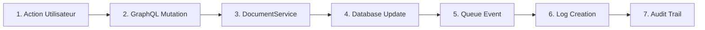

# Architecture du Projet Web EFREI

## Vue d'ensemble

Ce document présente l'architecture complète du projet web développé en utilisant une stack moderne avec **NestJS 11**, **React 19**, **GraphQL**, **PostgreSQL**, et **Redis**.

## 📁 Structure générale

L'application suit une architecture **3-tiers** avec une séparation claire des responsabilités et des modules transversaux :

- **Frontend** : Interface utilisateur (React 19 + TypeScript)
- **Backend** : API et logique métier (NestJS 11 + GraphQL)
- **Base de données** : Persistance des données (PostgreSQL + Prisma 6.x)
- **Message Queuing** : Traitement asynchrone (Redis + BullMQ + IoRedis 5.x)
- **Modules transversaux** : Common et Log pour la réutilisabilité

## 🎨 Frontend (React + TypeScript)

### Technologies utilisées

- **React 19** avec **TypeScript 5.8**
- **Vite 6.x** pour le build et le développement
- **TailwindCSS 4.x** pour le styling
- **Apollo Client 3.13** pour les requêtes GraphQL
- **React Router DOM 7.6** pour la navigation

### Pages principales

- **Home** : Page d'accueil
- **Login/Register** : Authentification
- **Dashboard** : Tableau de bord utilisateur
- **Documents** : Gestion des documents
- **Profile** : Profil utilisateur

### Composants

- **Navbar** : Navigation principale
- **ProtectedRoute** : Protection des routes
- **DocumentForm** : Formulaire de création/édition
- **DocumentDetail** : Affichage détaillé d'un document

## 🔗 API GraphQL

L'API GraphQL sert de **passerelle** entre le frontend et le backend, exposant :

### Queries

- `users` : Liste des utilisateurs
- `documents` : Liste des documents
- `getDocumentById` : Document par ID
- `me` : Utilisateur connecté
- `logs` : Historique des actions

### Mutations

- `login/register` : Authentification
- `createDocument/updateDocument/deleteDocument` : CRUD documents
- `createUser/updateUser/deleteUser` : CRUD utilisateurs

## 🛡️ Backend (NestJS + GraphQL)

### Modules principaux

#### 1. **Auth Module**

- **JWT Strategy** : Authentification par token
- **Local Strategy** : Authentification locale
- **Guards** : Protection des routes (GqlAuthGuard, RolesGuard)
- **Decorators** : Métadonnées d'authentification (@CurrentUser, @Roles)

#### 2. **User Module**

- **UserService** : Logique métier utilisateurs
- **UserResolver** : Résolveurs GraphQL
- **CRUD Operations** : Opérations de base
- **Role Management** : Gestion des rôles (ADMIN/USER)

#### 3. **Document Module**

- **DocumentService** : Logique métier documents
- **DocumentResolver** : Résolveurs GraphQL
- **File Management** : Gestion des fichiers
- **CRUD Operations** : Opérations de base avec audit

#### 4. **Health Module**

- **Health Controller** : Points de santé REST
- **Health Processor** : Traitement des vérifications
- **System Monitoring** : Surveillance système

#### 5. **Common Module**

Module transversal contenant les éléments partagés :

- **UserRole Enum** : ADMIN, USER
- **LogAction Enum** : CREATE, UPDATE, DELETE, VIEW
- **EntityType Enum** : DOCUMENT, USER
- **Prisma Converters** : Utilitaires de conversion Prisma-GraphQL

#### 6. **Log Module**

Module dédié à l'audit et la traçabilité :

- **LogService** : Service de gestion des logs
- **LogResolver** : Résolveur GraphQL pour les logs
- **Audit Trail** : Traçabilité complète des actions
- **Activity Tracking** : Suivi des activités utilisateur

## 📤 Message Queuing (BullMQ + Redis)

### Configuration et performance

- **Configuration Redis flexible** : Support des URL complètes et paramètres individuels
- **IoRedis 5.x** : Client Redis performant
- **Gestion d'erreurs robuste** : Résilience élevée

### Composants

- **Redis Server** : Stockage des files d'attente avec configuration flexible
- **Document Events Processor** : Traitement des événements de documents
- **User Events Processor** : Traitement des événements utilisateur
- **Health Events Processor** : Traitement des vérifications de santé
- **Log Events Processor** : Traitement des événements d'audit

### Queues configurées

```typescript
// Queues enregistrées dans app.module.ts
- 'health' : Queue de santé
- 'document-events' : Queue des événements de documents
- 'user-events' : Queue des événements utilisateur
- 'log-events' : Queue des événements d'audit
```

### Configuration Redis

```typescript
BullModule.forRoot({
  connection: process.env.REDIS_URL
    ? // Configuration avec URL Redis complète
      {
        host: new URL(process.env.REDIS_URL).hostname,
        port: parseInt(new URL(process.env.REDIS_URL).port) || 6379,
        username: new URL(process.env.REDIS_URL).username || undefined,
        password: new URL(process.env.REDIS_URL).password || undefined,
      }
    : // Configuration avec paramètres individuels
      {
        host: process.env.REDIS_HOST || "localhost",
        port: parseInt(process.env.REDIS_PORT || "6379"),
      },
});
```

## 🗄️ Base de données (PostgreSQL + Prisma)

### Tables principales

#### Users Table

```sql
- id (String, PK)
- email (String, unique)
- username (String)
- password (String)
- role (UserRole: ADMIN|USER)
- createdAt, updatedAt (DateTime)
```

#### Documents Table

```sql
- id (String, PK)
- title (String)
- description (String)
- fileUrl (String, nullable)
- userId (String, FK)
- createdAt, updatedAt (DateTime)
```

#### Logs Table

```sql
- id (String, PK)
- action (LogAction: CREATE|UPDATE|DELETE|VIEW)
- entityType (EntityType: DOCUMENT|USER)
- entityId (String)
- userId (String, FK)
- details (String, nullable)
- createdAt (DateTime)
```

## 🔄 Flux de création/suppression de document



### Détail du flux

1. **Action Utilisateur** : L'utilisateur crée/supprime un document via l'interface
2. **GraphQL Mutation** : `createDocument` ou `deleteDocument` est appelée
3. **DocumentService** : Le service traite la demande et valide les données
4. **Database Update** : Prisma ORM met à jour la base PostgreSQL
5. **Queue Event** : Un événement est ajouté à la queue Redis
6. **Log Creation** : Un log d'audit est créé via le Log Module
7. **Audit Trail** : Traçabilité complète dans la table Logs

## 🚀 Pipeline CI/CD (GitHub Actions)

### Configuration moderne

- **ESLint 9.x** : Configuration flat config
- **Tests robustes** : Modules de test séparés
- **TypeScript 5.8** : Support des dernières fonctionnalités

### Étapes du pipeline

#### 1. **Tests & Qualité**

- **ESLint 9.x** : Nouvelle configuration flat config
- **Jest Tests** : Tests unitaires avec modules dédiés
- **E2E Tests** : Tests end-to-end complets
- **Build validation** : `npm run build`

#### 2. **Docker Build & Deploy**

- **Multi-stage Build** : Optimisation des images
- **DockerHub Push** : Publication des images
- **Security Scan** : Scan de vulnérabilités avec Docker Scout
- **Cache Optimization** : Mise en cache des layers

### Configuration des services

```yaml
# Services Redis pour les tests
services:
  redis:
    image: redis:7.2-alpine
    ports: [6379:6379]
    health-checks: enabled
```

## 🐳 Infrastructure Docker

### Containers

- **Frontend Container** : React 19 + Vite (Port 5173)
- **Backend Container** : NestJS 11 + GraphQL (Port 3000)
- **Redis Container** : IoRedis 5.x (Port 6379)
- **PostgreSQL** : Prisma 6.x (Port 5432)

### Configuration

```yaml
# docker-compose.yml structure
- Redis avec persistance des données et configuration flexible
- Volumes pour la persistance
- Réseau interne pour la communication
- Support des variables d'environnement avancées
```

## 🔒 Sécurité

### Mesures implémentées

- **JWT Authentication** : Tokens sécurisés avec expiration
- **Role-based Access Control** : Contrôle d'accès par rôles via Common Module
- **CORS Protection** : Protection contre les requêtes cross-origin
- **Input Validation** : Validation des données d'entrée
- **Security Scanning** : Scan automatique des vulnérabilités
- **Audit Logging** : Traçabilité complète via Log Module

## 📊 Communication entre composants

### 1. Frontend ↔ API

- **GraphQL Queries/Mutations** via Apollo Client 3.13
- **Authentication Headers** avec JWT tokens

### 2. API ↔ Backend Services

- **Service Calls** directs entre modules
- **Dependency Injection** via NestJS
- **Common Module** : Partage des enums et utilitaires

### 3. Backend ↔ Database

- **Prisma ORM 6.x** pour l'accès aux données
- **Connection Pooling** pour les performances
- **Type Safety** avec Prisma converters du Common Module

### 4. Backend ↔ Message Queue

- **Queue Events** pour le traitement asynchrone
- **Job Processing** via les processors BullMQ
- **Configuration flexible** Redis URL/paramètres

### 5. Inter-Module Dependencies

- **Common Module** : Utilisé par Auth, User, Document modules
- **Log Module** : Intégré dans tous les modules pour l'audit
- **Centralized Enums** : Cohérence des types dans toute l'application

## 🎯 Avantages de l'architecture

1. **Scalabilité** : Modules granulaires et réutilisables
2. **Maintenabilité** : Code mieux structuré avec Common Module
3. **Performance** : Traitement asynchrone optimisé avec IoRedis 5.x
4. **Sécurité renforcée** : Audit trail complet via Log Module
5. **Observabilité** : Logs centralisés et monitoring intégré
6. **CI/CD moderne** : Pipeline avec dernières versions des outils
7. **Type Safety** : Meilleure cohérence des types via Common Module
8. **Audit & Compliance** : Traçabilité complète des actions utilisateur

## 📈 Monitoring et Logs

- **Health Checks** : Vérifications de santé automatiques
- **Centralized Audit Logs** : Log Module dédié pour la traçabilité
- **Queue Monitoring** : Surveillance des files d'attente Redis
- **Error Tracking** : Gestion centralisée des erreurs
- **Activity Tracking** : Suivi détaillé des actions utilisateur
- **Performance Metrics** : Métriques de performance des modules

## 🔧 Tests

### Modules de test séparés

- **TestAppModule** : Module dédié aux tests avec mocks
- **TestAuthModule** : Tests d'authentification isolés
- **TestDatabaseService** : Service de base de données pour tests
- **TestDocumentService** : Service de documents pour tests

### Configuration de test robuste

```typescript
// Mocks pour les queues BullMQ
const mockQueue = {
  add: jest.fn().mockResolvedValue({}),
  process: jest.fn(),
  close: jest.fn(),
};
```

## 🚀 Fonctionnalités avancées

1. **Module Common** : Centralisation des enums et utilitaires
2. **Module Log** : Audit trail et traçabilité complète
3. **Configuration Redis flexible** : Support URL et paramètres
4. **Tests modulaires** : Isolation et robustesse
5. **Type Safety** : Converters Prisma-GraphQL
6. **Pipeline CI/CD moderne** : ESLint 9.x, Jest optimisé
7. **Monitoring avancé** : Métriques et logs centralisés

Cette architecture permet un développement efficace, une maintenance simplifiée et une évolutivité optimale pour le projet.
