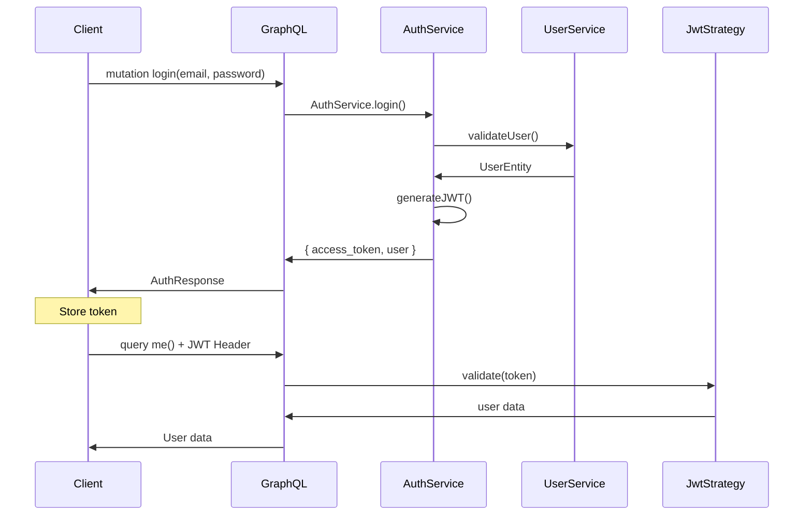

# 🔐 Module d'Authentification

Ce module implémente un système d'authentification complet avec **JWT**, **Passport.js**, et **GraphQL** pour une application NestJS.

## 📁 Structure du module

```
src/auth/
├── decorators/              # Décorateurs personnalisés
│   ├── current-user.decorator.ts    # Récupère l'utilisateur actuel
│   └── roles.decorator.ts           # Spécifie les rôles requis
├── dto/                     # Data Transfer Objects
│   ├── auth-response.ts             # Réponse d'authentification
│   ├── login.input.ts               # Input de connexion
│   └── register.input.ts            # Input d'inscription
├── guards/                  # Guards de protection
│   ├── gql-auth.guard.ts            # Guard JWT pour GraphQL
│   ├── jwt-auth.guard.ts            # Guard JWT standard
│   ├── local-auth.guard.ts          # Guard local
│   └── roles.guard.ts               # Guard pour les rôles
├── strategies/              # Stratégies Passport.js
│   ├── jwt.strategy.ts              # Stratégie JWT
│   └── local.strategy.ts            # Stratégie locale
├── auth.module.ts           # Module principal
├── auth.resolver.ts         # Resolver GraphQL
├── auth.service.ts          # Service d'authentification
├── auth.integration.spec.ts # Tests d'intégration
├── test-auth.script.js      # Script de test manuel
└── README.md                # Cette documentation
```

## 🚀 Fonctionnalités

### ✅ Implémentées

- **JWT Authentication** avec tokens expirables
- **Passport.js** avec stratégies JWT et Local
- **Hachage des mots de passe** avec bcrypt
- **GraphQL** mutations et queries protégées
- **Gestion des rôles** (ADMIN/USER)
- **Guards automatiques** pour protéger les routes
- **Tests d'intégration** complets
- **Protection CSRF** configurable

### 🔧 Configuration

#### Variables d'environnement

```env
JWT_SECRET=votre-clé-secrète-jwt-très-longue-et-complexe
NODE_ENV=development|production
```

#### Module Import

```typescript
import { AuthModule } from './auth/auth.module';

@Module({
  imports: [AuthModule, ...],
})
export class AppModule {}
```

## 📚 API GraphQL

### Mutations

#### Connexion

```graphql
mutation Login($loginInput: LoginInput!) {
  login(loginInput: $loginInput) {
    access_token
    user {
      id
      email
      username
      role
    }
  }
}
```

Variables :

```json
{
  "loginInput": {
    "email": "admin@example.com",
    "password": "password"
  }
}
```

#### Inscription

```graphql
mutation Register($registerInput: RegisterInput!) {
  register(registerInput: $registerInput) {
    access_token
    user {
      id
      email
      username
      role
    }
  }
}
```

Variables :

```json
{
  "registerInput": {
    "email": "user@example.com",
    "username": "utilisateur",
    "password": "motdepasse123",
    "role": "USER"
  }
}
```

### Queries

#### Profil utilisateur

```graphql
query Me {
  me {
    id
    email
    username
    role
  }
}
```

**Headers requis :**

```
Authorization: Bearer <votre_jwt_token>
```

## 🛡️ Protection des routes

### Utilisation des Guards

#### Authentification simple

```typescript
@UseGuards(GqlAuthGuard)
@Query(() => User)
async me(@CurrentUser() user: any) {
  return user;
}
```

#### Authentification + Rôles

```typescript
@UseGuards(GqlAuthGuard, RolesGuard)
@Roles(UserRole.ADMIN)
@Query(() => [User])
async users() {
  return this.userService.findAll();
}
```

### Décorateurs disponibles

#### `@CurrentUser()`

Récupère l'utilisateur actuel depuis le token JWT :

```typescript
async updateProfile(
  @CurrentUser() user: { userId: string; email: string; role: UserRole }
) {
  // user contient les données du token JWT
}
```

#### `@Roles()`

Spécifie les rôles requis :

```typescript
@Roles(UserRole.ADMIN)
@Roles(UserRole.ADMIN, UserRole.MODERATOR)
```

## 🧪 Tests

### Tests d'intégration

```bash
npm test -- auth.integration.spec.ts
```

### Script de test manuel

```bash
# Depuis la racine du projet
node src/auth/test-auth.script.js

# Avec une URL personnalisée
node src/auth/test-auth.script.js http://localhost:8080
```

Le script teste :

1. ✅ Connexion admin
2. ✅ Query protégée "me"
3. ✅ Route admin "users"
4. ✅ Inscription nouvel utilisateur
5. ✅ Connexion nouvel utilisateur

## 🏗️ Architecture

### Services

#### `AuthService`

- `validateUser()` - Valide email/password
- `login()` - Authentifie et génère JWT
- `register()` - Inscrit un nouvel utilisateur

#### `UserService`

- `findByEmailWithPassword()` - Pour l'authentification
- `createWithPassword()` - Création avec password hashé

### Stratégies Passport

#### `LocalStrategy`

Pour l'authentification par email/password

```typescript
@Injectable()
export class LocalStrategy extends PassportStrategy(Strategy) {
  async validate(email: string, password: string): Promise<UserEntity> {
    // Validation locale
  }
}
```

#### `JwtStrategy`

Pour la validation des tokens JWT

```typescript
@Injectable()
export class JwtStrategy extends PassportStrategy(Strategy) {
  async validate(payload: JwtPayload) {
    return {
      userId: payload.sub,
      email: payload.email,
      role: payload.role,
    };
  }
}
```

## 🔒 Sécurité

### Mots de passe

- **Hachage bcrypt** avec salt rounds = 10
- **Jamais stockés en clair**
- **Jamais exposés** via GraphQL

### JWT

- **Expiration** configurée (24h par défaut)
- **Secret** configurable via variables d'environnement
- **Payload minimal** (sub, email, role)

### Protection CSRF

- **Désactivée en développement** pour GraphQL Playground
- **Activée en production** par défaut

## 🚀 Utilisation

### 1. Headers d'authentification

```typescript
const headers = {
  Authorization: `Bearer ${access_token}`,
  'Content-Type': 'application/json',
};
```

### 2. Exemple avec Axios

```javascript
const response = await axios.post(
  '/graphql',
  {
    query: 'query Me { me { id email role } }',
  },
  { headers },
);
```

### 3. Exemple avec curl

```bash
curl -X POST http://localhost:3000/graphql \
  -H "Authorization: Bearer <token>" \
  -H "Content-Type: application/json" \
  -d '{"query":"query Me { me { id email role } }"}'
```

## 📊 Comptes par défaut

| Email             | Mot de passe | Rôle  |
| ----------------- | ------------ | ----- |
| admin@example.com | password     | ADMIN |
| user@example.com  | password     | USER  |

## 🔄 Flux d'authentification



## 🐛 Dépannage

### Erreur "Cannot read properties of undefined"

- Vérifiez que le contexte GraphQL est configuré
- Utilisez `GqlAuthGuard` au lieu de `JwtAuthGuard`

### Erreur CSRF

- Ajoutez `csrfPrevention: false` en développement
- Ajoutez les headers appropriés en production

### Token invalide

- Vérifiez l'expiration du token
- Vérifiez la clé JWT_SECRET
- Vérifiez le format du header Authorization
